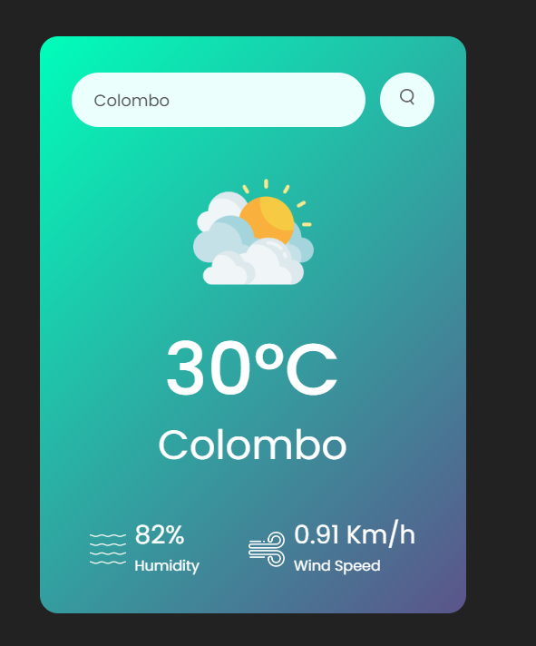

# Weather_App 

**Weather App** is used to find the weather conditions including **Temperature, Humidity, and wind speed** of the particular city. 

**[Visit to Live Server](https://bhashibandara95.github.io/BhashiBandara95_weather_app/)**
 

#### 🎥 Simple demo

<!--

-->

## ⭐ Features of the App 

- Get the current weather data from **Fetch API** fetch from **[openweathermap.org](https://openweathermap.org/)** and display the weather information like **Temperature, Weather condition, Humidity, and Wind Speed** according to the city on our website or app.

- Display the weather info on the website from Free API using JavaScript.

- For the weather app, we will add one search box where the user can enter the city name and get the weather information of the particular city.

## 💡 Usage 

1. Enter the city name in the search bar.
2. Then click the Search Button.

#### Interface  

  

### Result

  

## 🚀 Performance 

1. Value is taken by checkWeather function.
2. Function gets the result using web API.
3. Display the result

### 🧰 Technologies 

#### Languages

- HTML
- CSS
- JavaScript
    

#### Web API

- [openweathermap.org](https://openweathermap.org/)

### 📖 References : 

- [GreatStack](https://youtu.be/MIYQR-Ybrn4?si=tENMMdNROXwV0de9)
